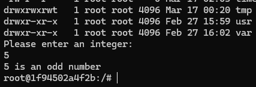

##1-1.現在の日付と時間を表示するスクリプトを作成しましょう
---
#!/bin/bash

ls -l ./

touch timefile

ls -l ./
datetime=`date '+%Y/%m/%d %H:%M:%S'`
echo $datetime
---

##1-2.数値を入力すると奇数か偶数か判定する対話型のスクリプトを作成しましょう
---
#!/bin/bash

ls -l ./

touch testfile

ls -l ./

echo "Please enter an integer: "
read num

if [ $((num % 2)) -eq 0 ]; then
    echo "$num is an even number"
else
    echo "$num is an odd number"
fi
---

